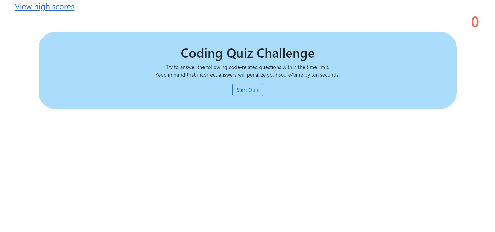
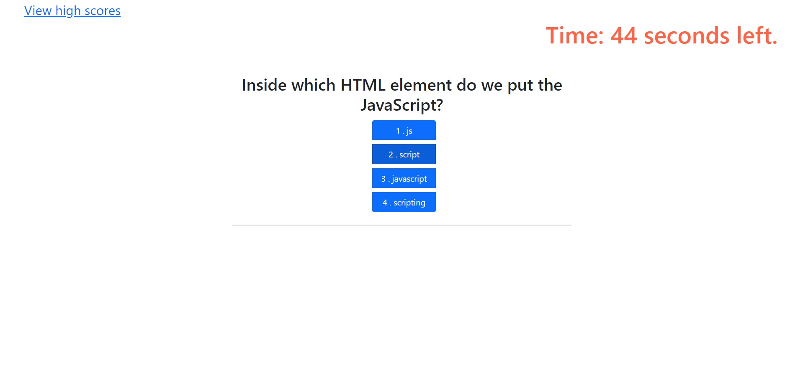
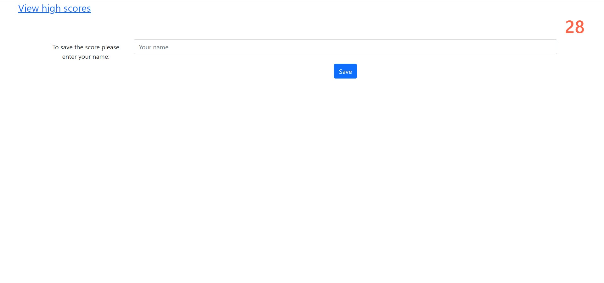

# code-quiz

## Description

AS A coding boot camp student

I WANT to take a timed quiz on JavaScript fundamentals that stores high scores

SO THAT I can gauge my progress compared to my peers

Coding assessments are an important part of the interview process for developers. In fact, employers often use them to filter out job candidates with a cut-off score. To help you prepare, I’ve developed a set of technical interview questions that you can answer throughout the course. The difficulty level of these questions will increase as you become a more proficient developer. If you take advantage of these opportunities to practice, you should be well-prepared to shine during the technical interview process toward the end of this course!

My goal is to build the website so that:

GIVEN I am taking a code quiz

WHEN I click the start button

THEN a timer starts and I am presented with a question

WHEN I answer a question

THEN I am presented with another question

WHEN I answer a question incorrectly

THEN time is subtracted from the clock

WHEN all questions are answered or the timer reaches 0

THEN the game is over

WHEN the game is over

THEN I can save my initials and score

When the user goes on, they see a home screen from which they can either begin the quiz or visit the high score page. The quiz runs through every question, logging the correct and wrong answers and keeping track of both the score and the time. When the quiz is finished, either by time-default or by completion, the user is told their score and is prompted to save it and store along with other scores. If the player wishes to play again, there is a button redirecting them to the opening title.  

## Installation

My repository on GitHub:

[https://github.com/sergiionyx/code-quiz](https://github.com/sergiionyx/code-quiz)

The link to the live website: 

[https://sergiionyx.github.io/code-quiz/](https://sergiionyx.github.io/code-quiz/)

## Usage

Screenshots: 

## Credits

All my credits to amazing TA's! They have ability to explain all difficult stuff with simple words!

## License

Copyright (c) [2022] [Sergii Onyshchenko]

Permission is hereby granted, free of charge, to any person obtaining a copy
of this software and associated documentation files (the "Software"), to deal
in the Software without restriction, including without limitation the rights
to use, copy, modify, merge, publish, distribute, sublicense, and/or sell
copies of the Software, and to permit persons to whom the Software is
furnished to do so, subject to the following conditions:

The above copyright notice and this permission notice shall be included in all
copies or substantial portions of the Software.

THE SOFTWARE IS PROVIDED "AS IS", WITHOUT WARRANTY OF ANY KIND, EXPRESS OR
IMPLIED, INCLUDING BUT NOT LIMITED TO THE WARRANTIES OF MERCHANTABILITY,
FITNESS FOR A PARTICULAR PURPOSE AND NONINFRINGEMENT. IN NO EVENT SHALL THE
AUTHORS OR COPYRIGHT HOLDERS BE LIABLE FOR ANY CLAIM, DAMAGES OR OTHER
LIABILITY, WHETHER IN AN ACTION OF CONTRACT, TORT OR OTHERWISE, ARISING FROM,
OUT OF OR IN CONNECTION WITH THE SOFTWARE OR THE USE OR OTHER DEALINGS IN THE
SOFTWARE.